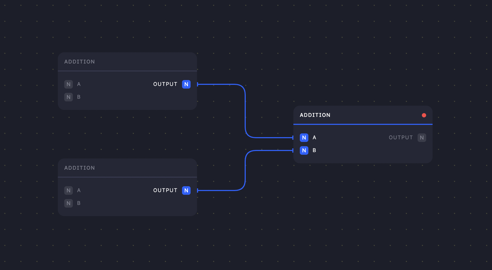

# Concepts

## Nodes

Nodes are units that consists of inputs and outputs, which performs some kind of operation. They're conceptually very similar to functions, with the difference that outputs may be multiple, compared to a function's single return value.

An Addition Node may for instance have two inputs and a single output, which assigns the output the sum of the inputs.



### Inputs

Inputs are EventEmitter-like entities with an initial value; capable of emitting its current value upon mutation. Whenever its value is mutated, it emits the new value to its subscribers (most often Outputs on the same Node).

### Outputs

Outputs are a little different. They're also EventEmitter-like entities, but they don't have an initial value. All Outputs are computed dynamically, and has an internal buffer with its last emitted value. Whenever a connection is established between an Output & an Input - the internal buffer will replay its last computed value and assign it to the Input (which in turn will emit its newly assigned value to its dependants).

## Connections

Connections are responsible for carrying values between Outputs & Inputs. Connections may only be initiated between an Output and an Input.

```typescript
const additionNode1 = new Addition();
const additionNode2 = new Addition();

const connection = additionNode1.outputs.output.connect(additionNode2.inputs.a);

/**
 * Call the dispose-method to disconnect
 * The input will fallback to its default value upon disconnection
 */
connection.dispose();
```

## Schemas

Nodl uses Zod for value validation. Each Input & Output has an assigned type; configured by a schema. Connected outputs & inputs must share the same underlying type schema.

```typescript
import { schema } from '@nodl/core';
import { z } from 'zod';
import * as color from 'color';

/** An appropriate name for this schema will be inferred automatically */
const NumberSchema = schema(z.number());

/** Pass an optional name if you want to define the schema name yourself */
const MyCustomSchema = schema(
    'Color',
    z.custom((value: any) => color(value))
);
```
